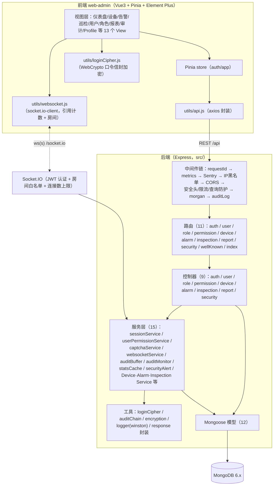
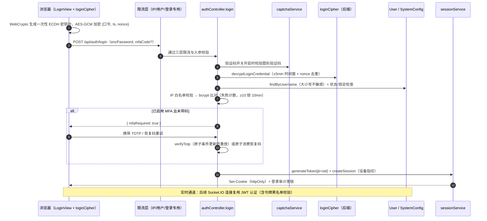
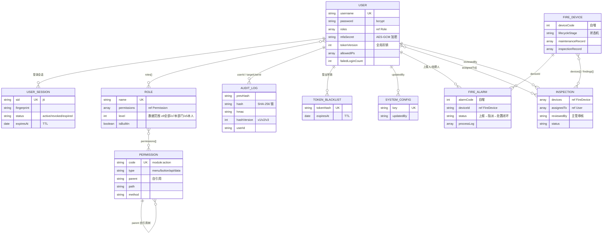
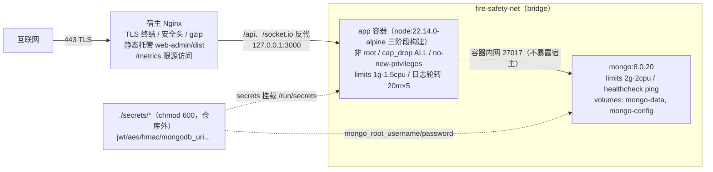

# 系统架构文档

> 优化清单 H-3 建档（2026-08-29）。图均为 Mermaid 源码，GitHub / VS Code / Typora 可直接渲染。
> 安全决策背景另见 [ADR 目录](./adr/README.md)。

## 1. 总体架构

前后端分离：Vue 3 管理后台 + Express REST API + MongoDB，Socket.IO 承载实时推送。

**分层约定**：请求一律经 路由 → 控制器 → （服务层）→ 模型。已知技术债：部分控制器直连模型（优化清单 D-1），新功能要求强制经服务层。

## 2. 登录时序

关键实现：`src/controllers/authController.js`（login 约 L264）、`src/utils/loginCipher.js`、`src/services/sessionService.js`；时序对齐防用户枚举（哑 bcrypt 耗时）。

## 3. 数据模型（ER 图）

模型清单：`User / Role / Permission / FireDevice / FireAlarm / Inspection / AuditLog / UserSession / TokenBlacklist / IPBlacklist / SystemConfig`（`src/models/`）。

## 4. 部署拓扑

当前 `docker-compose.yml` 定义的目标生产形态（TLS 终结的 Nginx 在宿主侧，示例配置见 `deployment/nginx.conf.example`）：

要点：

- **密钥注入**：全部经 Docker secrets 文件（`*_FILE`），`environment` 只留非敏感项（见 ADR-003）
- **镜像钉版本**：`node:22.14.0-alpine`、`mongo:6.0.20`；digest 待部署机 `docker pull` 后捕获回填（优化清单 R-5）
- **Redis** 已在 compose 中预留（注释态），规模化时启用并承接限流/缓存/分布式锁（R-3/A-1）
- **待落地**：前端静态托管的生产闭环（L-1，P0）——Nginx 托管 dist 或后端 express.static 二选一，并复测无 `/src/` 与 sourcemap 泄露

## 5. 前端结构速览

- 路由：`Layout` 包裹 11 个业务子路由（`meta.permission` 控权）+ 独立登录/注册页；`beforeEach` 做会话恢复与权限校验
- 实时推送场景：权限变更同步（`permission-sync` 定向投递）、告警实时推送、设备状态更新
- 全局兜底：`utils/errorReporter.js` 收敛组件/资源/未处理 Promise 三路错误（G-1）
